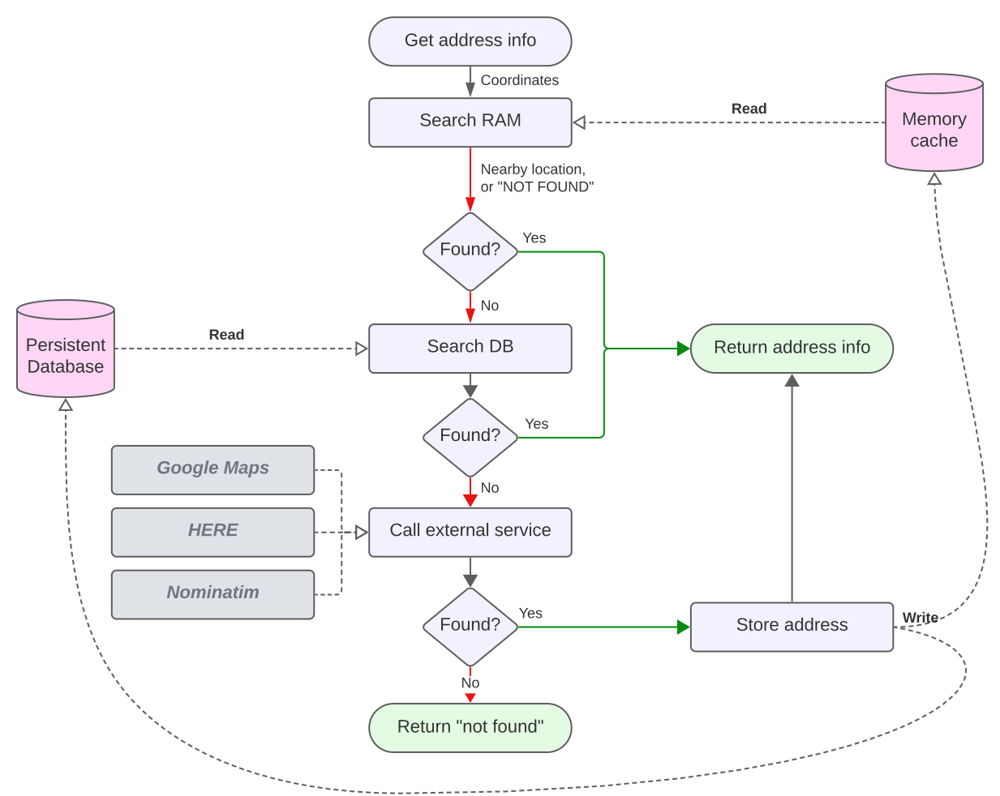

# geocoder-cache
This is the source code for a geocoder and reverse geocoder service, with caching.

- Provides a REST API
- Abstracts away the differences between external geocoding services
- Caches results, to avoid hitting the external services too often
- Caching is configurable. Currently two caching methods are supported:
  - In-memory cache (very fast, but limited in size)
  - DynamoDB cache (slower, but unlimited size, and can be shared between multiple instances)
- Platform-independent
- Can be used as a standalone service, or as a library
- Can be used as a proxy for the Google Maps API, to avoid having to expose your API key



## Why use this?
- You want to use multiple geocoding services, but don't want to deal with the differences between them
- You want to cache results, to avoid hitting the external services too often
  - Calling services like Google Maps too often with the same requests leads to unnecessary costs
- You want to use the Google Maps API, but don't want to expose your API key to the client
  - This service can be used as a proxy for the Google Maps API, so the client doesn't need to know your API key
- You don't want to be locked in to a specific geocoding service
  - This service can be used as a proxy for multiple geocoding services, so you can easily switch between them

## Getting started
### Pre-requisites
- NodeJs
- npm or yarn
- Google Maps API key (optional)
- Git

### Steps
1. **Get code**
   - Clone repo:
      - `git clone https://github.com/WouterVanNifterick/geocoder-cache.git`
   - Install dependencies: 
      - `npm install` or `yarn`

2. **Configure**
   - Create a `.env` file in the root directory
   - <details><summary>Configure Google API (optional)</summary>
     
     - Go to https://developers.google.com/maps/documentation/javascript/get-api-key
     - Click "Get a key"
     - Follow the instructions
     - Copy the API key
     - Paste the API key in the `.env` file

```javascript
PORT=3000
GOOGLE_MAPS_API_KEY="<your google maps api key>"
```    
   </details>

3. **Run**
   - Run the server: `npm start` or `yarn start`
   - Open `http://localhost:3000` in your browser
4. Enjoy!

## Tests
To run tests, run `npm test` or `yarn test`.

## API
### Reverse geocoding
#### Request
`GET /reverse?lat=<latitude>&lng=<longitude>`

#### Response

Reverse geocoding responses always look like this:

- **Status**: 
  - 200: OK
  - 404: Not found
- **Locations**: array of locations
- **Stats**: processing time and whether the result was cached

```json
{
  "status": {
    "code": 200,
    "message": "OK"
  },
  "locations": [
    {
      "formattedAddress": "9F563GC2+58",
      "type": "Point",
      "latitude": 53.0705,
      "longitude": 4.5007544,
      "confidence": 0.7,
      "googlePlaceId": "GhIJGi_dJAaJSkAR-k_twsUAEkA",
      "provider": "google",
      "source": "node-geocoder",
      "cached": "2023-08-27T13:11:13.083Z"
    }
  ],
  "stats": {
    "processingTimeMs": 175,
    "fromCache": false
  }
}
```

##### Not found
Response when there are no matches:
```json
{
  "status": {
    "code": 404,
    "message": "Not found"
  },
  "locations": [],
  "stats": {
    "processingTimeMs": 0,
    "fromCache": false
  }
}
```

### Cache
#### Request
`GET /cache`

#### Response
```json
{
  "status": {
    "code": 200,
    "message": "OK"
  },
  "cache": {
    "size": 1,
    "hits": 0,
    "misses": 1,
    "keys": [
      "9F563GC2+58"
    ]
  }
}
```